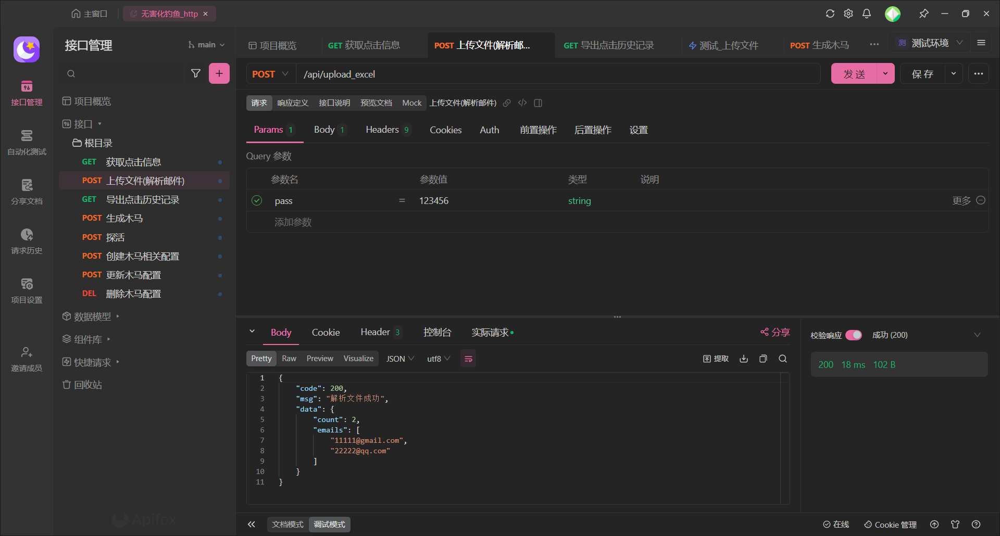

# 项目介绍：

本项目使用了gin+gorm+grpc实现的一个无害化钓鱼平台。
无害化点在于：点击木马文件后进行截图，并且发送给服务端，同时弹出文件（文件内容可自定义，由服务端返回）提示用户已被钓鱼。

本项目初衷用于钓鱼演练中，如有恶意使用，请自行承担后果。

# 主要功能：

- 上传excel后，可一键导入被钓鱼名单。
- 根据导入的邮件，可以批量生成发送邮件对应的木马，实现一人一马（木马的访问服务端主要靠邮件地址+盐后md5，伪造难度较大）。
- 被钓鱼者点击木马后释放文件，同时打开文件（文件内容和释放的名称，由服务端进行返回，可自定义）。
- 记录被钓鱼者的相关主机信息（ip信息，whoami，点击木马时的截图，点击时间）。
- 支持导出所有点击事件功能。

后续更新/优化列表：

- 批量发送邮件功能。
- 木马批量添加ico，数字签名。
- 前端页面。

提示：由于方便使用，因此所有请求都是路径带上pass={pass}的，这个pass主要在config.yaml中使用，后续编写前端后会采用
jwt进行登录授权校验。

# 使用说明：

1.修改配置文件，默认为当前目录下的`config.yaml`：

```yaml
database:
  host: localhost   # 编写你的vpsip
  port: 3306        # mysql端口
  user: root        # mysql用户名
  password: 123456  # mysql账号
  db: fish          # 这里不需要修改

server:
  ip: 127.0.0.1     # 这里写真实ip 主要用于图片展示
  pass: 123456      # 访问的密码
  salt: "xxxx"      # 用于混淆agent马的key 如 123456@qq.com salt为test => md5(md5(123456@qq.com)test) 小写32位
  # grpc服务配置 用于图片截图
  grpc:
    port: 50001     # grpc服务端口
  # web服务配置
  web:
    port: 50002     # web服务端口库 用于提供钓鱼服务
    prefix: /api    # web路径前缀
  # 静态文件配置
  static:
    file_path: ./static # 本地存储文件的路径
    web_path: /static/img # 网页访问路径前缀 如写/static/img 则web访问路径为 http://ip:port/(web_prefix)/static/img

# 邮件配置
smtp:
  host: smtp.163.com
  port: 465
  user: xxxx@163.com
  password: xxxxx

```

2.运行`main.go`启动web服务，启动前请确保mysql能正常连接，启动成功后自动创建`fish`数据库，以及对应的表。


运行成功后，导入被钓鱼者的邮件，可通过文件导入：


这里通过Apifox进行调用，注意所有的接口都需要添加param，pass={pass}，这个pass为配置文件中的pass。


通过表单上传文件，上传成功后返回被钓鱼者的邮件，同时查看数据库user表中已经插入刚才导入的数据。


3.生成木马：

3.1 自行编译源码：

在当前目录`template`下存在一个`agent.exe`和`agent.go`,其中`agent.exe`是使用命令`go build agent.go`编译的。
`agent.exe`可以看作为模板文件，也可以自己对`agent.go`文件进行修改后自行编译。

3.2 程序生成木马：

如果使用生成木马的话，请使用`/{baseurl}/gen`接口，接受json结构体。

其中rebuild表示是否重新编译，如果为true，则会调用`go build agent.go`编译，
rebuild为true则会根据`template/agent.exe`对该二进制木马禁止修改，不会重新编译。

emails则表示生成的木马，可以传入多个邮箱地址，即可生成一个邮箱对应的一个木马。

**注意：该功能点暂未完善，目前仅支持rebuild为false，即在编译好的木马上对二进制内容进行修改，会在下一个版本进行完善。**


4.配置服务端返回内容：

这里配置服务端返回内容是指，木马被点击后，会在当前目录下生成一个文件以及写入对应的文件内容，并且打开。

这里就需要调用`/{baseurl}/agent/create_config`，提交对应的表单数据，上传对应的文件和agent木马运行后打开的文件名。


查看数据库`agent_message`可以看到上传文件的信息。


5.木马运行：

运行成功后会创建对应的文件内容，并且打开了对应的文件。


此时调用`{baseurl}/api/info/{邮箱md5加盐值}`，即可查看到相关的点击事件


支持导出所有列表：

访问`{baseurl}/export_message?pass=123456`即可导出所有点击的事件


6.探活：

使用post方法请求`{baseurl}/alive/{邮件md5加盐加密}`，可查询当前用户是否正在运行此程序：


如果不填写邮件的md5，则会返回所有存活用户：


# 效果图：

## 免杀效果：


[](https://star-history.com/#pow1e/pfish&Date)